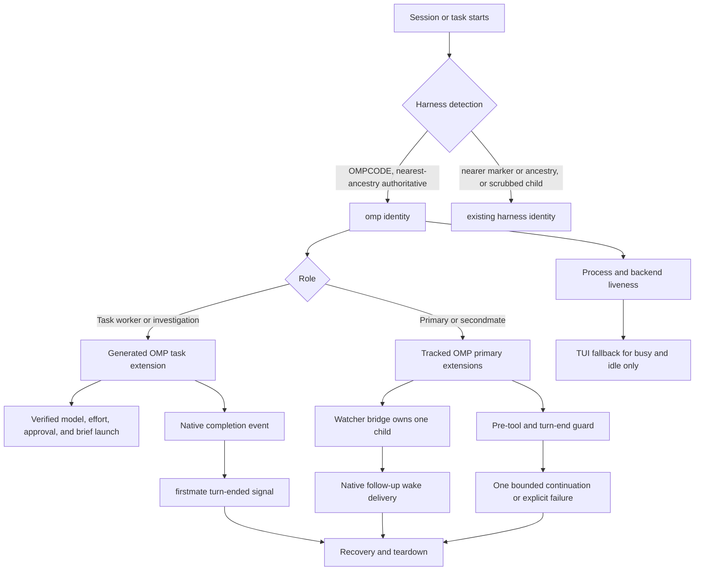

# First-Class Oh My Pi Harness Support - Plan

## Goal Capsule

### Objective

Make Oh My Pi (`omp`) a verified, first-class firstmate harness for primary sessions, task workers, investigations, and secondmates without regressing Claude, Codex, OpenCode, Pi, or Grok behavior.

### Authority hierarchy

1. This Product Contract defines the required behavior and scope.
2. Live OMP behavior observed in an isolated verification environment overrides assumptions derived from documentation.
3. Current OMP source and official documentation define supported APIs and CLI syntax.
4. Existing firstmate harness contracts define safety, supervision, and delivery invariants.
5. Existing Pi-family code may be reused only after equivalent OMP behavior is demonstrated.

### Execution profile

- Start with a controlled OMP verification spike before changing permanent harness policy.
- Implement a distinct `omp` identity and share only behavior proven equivalent to Pi.
- Preserve the clean-cutover rule: update every harness allowlist, branch, caller, test, and operational reference; leave no aliases or compatibility shims.
- Run targeted tests after each implementation unit, then the repository lint and validation pipeline.
- Record exact OMP version, commands, environment, and observed outcomes for every live claim promoted into support policy.

### Stop conditions

Stop and report a blocker rather than weakening the contract when any of these occurs:

- OMP cannot load a deterministic, firstmate-owned extension without an unmanaged trust prompt.
- OMP lacks a usable native per-turn completion event, primary stop hook, pre-tool block result, idle-and-streaming follow-up API, or countable continuation mechanism.
- Unattended execution cannot preserve the requested model, reasoning level, and approval policy.
- Completion or wake events duplicate, disappear, interrupt active output, or cross firstmate-home boundaries.
- The primary turn-end guard can recurse indefinitely or exhaust OMP continuations silently rather than ending loudly with a visible failure after its bounded allowance.
- A live OMP worker or secondmate is classified as dead, a genuinely dead Bun/Node-presenting owner is never respawned, or recovery can create a second live owner.
- Generated extension code can be replaced or augmented through profile, project-local, or mutable discovery, or the generated worker extension cannot be integrity-checked and permission-locked before it loads.
- Herdr cannot host or classify an OMP/Bun agent, so a live secondmate could be self-killed or a genuinely dead one left unrespawned.
- A named OMP launch cannot resolve the executable from a trusted absolute path, verify its provenance, or confirm the running OMP is inside the supported version range before extensions load.
- An OMP primary extension cannot resolve its own `FM_HOME` at load and would fall back to the shared code root, breaking home isolation.
- The pre-merge live evidence cannot be sanitized of captured credentials before it is handed off and attached.
- Existing supported harness tests regress.

### Tail ownership

The implementation executor owns the verification spike, code, targeted tests, documentation, and implementation commit.
The executor also owns producing the single sanitized durable live-evidence artifact defined in R39 and handing it to the supervising firstmate session before repository validation begins.
The supervising firstmate session owns the repository validation pipeline, PR creation, CI follow-through, review decisions, and merge approval according to the existing project delivery contract, and it must confirm the handed-off evidence passed redaction before treating it as validation evidence.

---

## Product Contract

### Summary

Add `omp` as a distinct harness identity across detection, launch, supervision, lifecycle control, cleanup, documentation, and recovery.
Reuse Pi-family capabilities only where live verification proves equivalence, while OMP-native extension events remain the authoritative source for task completion and primary-session supervision.

### Problem Frame

OMP currently exports both `OMPCODE=1` and `CLAUDECODE=1` to child processes.
The current detector checks `CLAUDECODE` before any OMP marker, so an OMP session is classified as Claude and receives the wrong lifecycle policy.
This has already produced a startup failure in which the lock owner could not be identified.

OMP exports `OMPCODE=1` to every descendant, so a correction that merely makes `OMPCODE` win unconditionally would create the mirror-image regression: a non-OMP child launched under an OMP primary would inherit the marker and misdetect as `omp`.
Because the captain has settled that mixed Claude, Codex, and Grok workers and secondmates under an OMP-led session are supported, the precedence rule must make a nearer own-harness marker or process ancestry authoritative over an inherited `OMPCODE`, and non-OMP launches must scrub the inherited marker.
Identity must be correct for both the OMP session and its non-OMP children before any harness-specific policy is selected.

The session lock and the harness detector independently assume a fixed list of harness process names and invoke `basename` unsafely on a login-shell command name.
Under OMP, the process-ancestry check failed and `basename` interpreted the command name as an option.
The same option-unsafe `basename` exists at both sites, so both must be fixed.

OMP exposes the primitives firstmate needs: non-interactive launch controls, model and reasoning selection, explicit extension loading, lifecycle events, tool-call blocking, queued follow-up messages, and session continuation.
API availability does not prove end-to-end supervision, so the implementation must verify live behavior under the terminal backends firstmate actually supervises.

### Actors

- A1. The captain starts or interacts with firstmate through OMP.
- A2. A primary firstmate session owns fleet state and supervision.
- A3. An OMP task worker implements or investigates project work.
- A4. An OMP secondmate manages its own isolated firstmate home.
- A5. The firstmate runtime detects, launches, monitors, steers, resumes, and cleans up harness sessions.

### Requirements

#### Identity and configuration

- R1. `fm-harness.sh own` must return `omp` for a genuine OMP session when `OMPCODE=1` is present, including when the inherited `CLAUDECODE=1` compatibility marker is also present, but an inherited `OMPCODE` must never override a nearer own-harness marker or process ancestry (see R31).
- R2. Process-ancestry detection must recognize native OMP process shapes without misclassifying Pi, Claude, Codex, OpenCode, or Grok, including a non-OMP session that runs as a descendant of an OMP process, which must detect as its own harness rather than as `omp`.
- R3. Every verified-harness allowlist and configuration validator must accept `omp` and continue rejecting unknown values.
- R4. Session-lock ownership must recognize OMP process ancestry, and every `basename` site that normalizes a command name (session lock and harness detection) must handle command names beginning with `-` without option injection.
- R5. Crew, dispatch-profile, and secondmate configuration must support `omp` through the same precedence rules as existing harnesses.
- R31. When firstmate launches a non-OMP worker or secondmate under an OMP primary, the launch must scrub the inherited OMP identity markers unconditionally for every non-OMP child rather than keyed to specific harness names, and/or make nearer process ancestry authoritative, so every non-OMP child retains its own identity and lifecycle policy; acceptance coverage verifies the captain's settled set of Claude, Codex, and Grok, while the same unconditional mechanism also protects OpenCode and Pi children.
- R32. The OMP/Claude detection-precedence correction and the option-safe `basename` fixes at both sites must land as an independent early milestone that does not add `omp` to any first-class supervision allowlist; first-class OMP activation is gated on the complete supervision, lifecycle, recovery, and verification contracts.

#### Launch and autonomy

- R6. Task-worker launch, including investigations that use the same execution path, must pass the selected model, every existing firstmate effort level, unattended approval policy, deterministic extension path, and brief without lossy translation.
- R7. Secondmate launch must load both the primary turn-end guard and watcher bridge before the charter is submitted.
- R8. OMP-specific launch arguments must be derived from verified installed CLI behavior rather than copied from Pi or inferred from help text alone.
- R9. The raw-launch escape hatch must remain available for future adapter verification without weakening named-adapter validation.
- R10. Existing harness launch templates and effort mappings must remain unchanged.
- R33. A firstmate-launched OMP role (task worker and secondmate) must resolve the OMP executable from a configured absolute path, verify the executable's ownership, permissions, and supported release checksum against a supported-version list and known-good checksums pinned in committed firstmate material rather than derived from the same source as the binary, and reject an OMP outside the supported version range as an explicit unsupported-version failure before any extension loads; because OMP presents as a Bun or Node process, U1 establishes whether the checksummed surface is a self-contained binary or a separately installed package so the gate covers the code that actually runs, and the captain-launched primary's executable is a documented captain precondition rather than a firstmate-enforced gate.
- R34. A firstmate-launched OMP worker or secondmate must construct its child environment from a cleared base rather than inheriting the primary's ambient environment, re-exporting only the required non-credential runtime variables and injecting only the provider and repository credentials the role needs, keeping secrets out of argv and generated extensions; the captain-launched primary's secret-free environment is a documented captain precondition, with the fail-closed `FM_HOME` guard (R15) as the only in-session backstop.

#### Worker lifecycle

- R11. An OMP task extension must emit exactly one firstmate turn-ended signal for each completed agent turn by binding a per-turn completion event, not a per-run or exit event, and a dropped completion event must be detectable rather than silently lost.
- R12. Task extension code must live outside project worktrees, load only from a firstmate-owned deterministic path, and be removed during teardown.
- R13. Worker completion must not depend on terminal-text scraping when an OMP lifecycle event provides the same fact.
- R14. OMP skill invocation, ordinary prompts, and follow-up messages must reach the intended session without autocomplete or submission-state ambiguity.
- R35. The generated worker extension must be written with restrictive permissions, have its integrity verified immediately before loading, run with ambient profile and project discovery disabled or isolated during worker launch, and adopt the token-match guard the Grok worker hook already uses so a stale or foreign extension cannot fire.

#### Primary supervision

- R15. A primary OMP watcher bridge must own extension-driven watcher continuity per the landed `docs/watcher-continuity.md` contract: keep one in-flight watcher child or scheduled retry, and after an actionable child close start and verify a singleton successor and recheck session-lock ownership before delivering the wake, apply bounded exponential retry, and deliver a typed continuity-restoration failure when restoration cannot succeed so the model is never left blind; it must resolve `FM_HOME` fail-closed at extension load and preserve firstmate-home isolation.
- R16. A primary OMP turn-end guard must run the shared watcher and working-directory seatbelts before bash commands execute.
- R17. When a primary turn would end without required supervision, the guard must request at most one bounded continuation for that failed stop attempt.
- R18. Repeated missing-supervision states must surface as an explicit visible failure instead of consuming OMP's continuation allowance silently or recursing; once the bounded allowance is spent the turn may end loudly with that visible failure, which is a deliberate bounded relaxation of the "no primary turn ends blind while work is active" invariant, not an absolute guarantee that the turn never ends unsupervised.
- R19. Extension load, watcher-child, message-delivery, pre-tool-checker-spawn, and cleanup failures must remain observable and fail visible as typed watcher failures recorded to the per-cycle exit log the landed watcher-continuity contract defines; no catch path may silently succeed, silently terminate supervision, or silently let a forbidden command run, and a failed follow-up delivery must never cancel continuity restoration.
- R20. Primary extension markers must identify the loaded content version and process so startup can distinguish loaded, stale, and missing integrations; this self-written hash is a staleness and freshness diagnostic only and must not be treated as tamper integrity (see R37).
- R36. An async wake-delivery failure that occurs while the primary is idle, with no live turn to receive a surfaced error, must be recorded to the durable per-cycle exit log the landed watcher-continuity contract defines, which the watcher or session start reads, and continuity restoration must proceed independently of whether the wake prompt delivered, so the failure is neither silently dropped nor able to cancel re-arm.
- R37. The extension trust model must rest on path-pinning, restrictive permissions, and discovery disablement or isolation before any untrusted extension code executes, because an OMP or Pi extension's default export runs at import and a discovered augmenting handler that is merely rejected has already run; a real integrity guarantee, if claimed, requires a trusted out-of-band committed manifest, not the self-written hash.

#### Liveness, control, and recovery

- R21. Busy, idle, exited, and crashed OMP states must be classified correctly under tmux and Herdr.
- R22. A live OMP secondmate must never be declared dead solely because the foreground process is a Bun, Node, or wrapper process.
- R23. Escape must interrupt a running OMP turn, Ctrl+D must exit an idle session, and the verified resume command must restore the intended session.
- R24. Watcher wakes sent while OMP is idle must start a turn; wakes sent while it is streaming must queue safely for follow-up.
- R25. Cleanup must stop extension-owned children, remove generated task artifacts, preserve landed-work safeguards, and leave project worktrees clean.
- R26. Recovery must be verified after each of a primary restart, a worker exit, a secondmate restart, and a stale extension marker, each preserving correct identity, exactly one live owner, one watcher child, and no duplicate wake; a genuinely dead Bun or Node-presenting OMP owner must be confidently classified dead and respawned exactly once, never left unrespawned by an over-conservative `unknown` classification.
- R38. Herdr must be pre-verified in the U1 spike to host and classify an OMP or Bun agent before Herdr parity is claimed; if it cannot, Herdr support is a blocker or an explicitly staged deferral behind tmux, never an assumed dependency.

#### Documentation and compatibility

- R27. `harness-adapters` must record verified OMP launch, busy, idle, interrupt, exit, resume, trust, skill-invocation, and cleanup behavior with dated evidence.
- R28. Supervision documentation must define OMP's primary operating block and bounded turn-end behavior.
- R29. Configuration and contributor documentation must list OMP only after the live acceptance matrix passes.
- R30. Existing Claude, Codex, OpenCode, Pi, and Grok behavior and tests must remain unchanged.
- R39. The pre-merge live evidence must be a single sanitized durable artifact in which argv is redacted allowlist-style by keeping only a known-safe token set and captured process environment values are redacted to variable names, with a defined storage location, access restriction, and retention and deletion policy; it must be handed from the executor to the supervising firstmate session before repository validation, and documentation may call OMP verified only after redaction has passed.

### Key Flows

#### F1. Start firstmate in OMP

1. OMP starts with both OMP and Claude compatibility markers present.
2. The detector selects `omp` from the OMP marker, while a nearer non-OMP marker or ancestry would override an inherited `OMPCODE`.
3. Session-lock ownership and the detector locate the OMP ancestor without treating command names as options at either `basename` site.
4. Startup validates the expected OMP primary extensions and content-version markers.
5. The OMP supervision operating block is emitted, but only once first-class activation is present, not in the early detection-correctness milestone.

#### F2. Launch an OMP task worker

1. Intake resolves `omp` through an explicit override, dispatch profile, or primary-harness default.
2. Spawn generates the worker extension in firstmate state, outside the worktree.
3. The launch command passes verified model, effort, approval, extension, and brief arguments.
4. OMP loads the extension and begins the task without an interactive trust gate.
5. The task lifecycle event writes exactly one completion signal per completed turn.

#### F3. Supervise through OMP

1. The primary watcher bridge keeps one in-flight home-scoped watcher child or scheduled retry.
2. An actionable child close returns a wake reason.
3. The extension starts and verifies a singleton successor and rechecks session-lock ownership before delivering the wake, applying bounded exponential retry.
4. It then delivers the follow-up through OMP's native messaging API; idle delivery starts a turn and streaming delivery queues the follow-up.
5. If restoration exhausts its retry limit, the extension delivers the wake with a typed continuity-restoration failure so the primary is never left blind.

#### F4. Prevent a blind primary turn end

1. OMP reaches the primary session-stop lifecycle event.
2. The extension invokes the shared turn-end predicate.
3. A clean predicate result allows the session to stop.
4. A missing-supervision result requests one continuation with actionable context.
5. When the bounded continuation allowance is spent and supervision is still absent, the extension surfaces an explicit visible failure and ends the turn loudly rather than recursing or ending silently blind.

#### F5. Recover and clean up

1. Recovery validates session identity, extension markers, process liveness, and backend endpoint state.
2. A recoverable OMP session resumes through the verified session command.
3. A terminated task is reconciled without falsely classifying a live wrapper process, while a genuinely dead Bun or Node-presenting owner is confidently classified dead and respawned exactly once.
4. Teardown stops extension children and removes generated OMP artifacts.
5. Project worktrees remain unmodified by integration files.

#### F6. Run a non-OMP child under an OMP primary

1. An OMP primary launches a Claude, Codex, or Grok worker or secondmate.
2. The launch scrubs the inherited OMP identity markers and/or relies on nearer process ancestry.
3. The child detects as its own harness and selects its own lifecycle and supervision policy, not `omp`.
4. The child's session lock and detection tolerate an option-like login-shell command name at both `basename` sites.
5. The child's supervision, completion, and teardown behave exactly as they do outside an OMP primary.

### Acceptance Examples

- AE1. Given `OMPCODE=1` and `CLAUDECODE=1`, when harness detection runs, then the result is `omp`.
- AE2. Given `CLAUDECODE=1` without `OMPCODE`, when detection runs, then the result remains `claude`.
- AE3. Given an OMP process ancestor with no environment marker, when ancestry fallback runs, then the result is `omp`.
- AE4. Given a login-shell command name beginning with `-`, when lock ownership is evaluated, then no `basename` option error occurs.
- AE5. Given each supported firstmate effort value, when an OMP task launches, then OMP receives the verified equivalent without rejecting or silently downgrading it.
- AE6. Given one completed OMP worker turn, when the lifecycle event fires, then one and only one task turn-ended signal is written.
- AE7. Given a primary OMP session with supervision absent, when session stop fires, then exactly one continuation is requested for that stop attempt.
- AE8. Given the continuation still lacks supervision, when the session reaches stop again, then the extension reports failure and does not recurse.
- AE9. Given a forbidden watcher-arm or persistent working-directory command, when OMP invokes bash, then the pre-tool extension blocks execution with the shared checker reason.
- AE10. Given an actionable watcher wake while OMP is idle, when the watcher child exits, then a new primary turn begins with the wake context.
- AE11. Given an actionable wake while OMP is streaming, when delivery occurs, then the wake is queued once as a follow-up and no active output is interrupted.
- AE12. Given the same primary extension is discovered and passed explicitly, when OMP starts, then handlers register once rather than producing duplicate wakes.
- AE13. Given an OMP worker under tmux or Herdr, when it transitions between generating, idle, interrupted, exited, and resumed states, then firstmate classifies each state correctly.
- AE14. Given a live OMP secondmate whose foreground child is Bun or Node, when liveness is checked, then it remains alive.
- AE15. Given task teardown, when cleanup completes, then generated OMP extension files and children are gone and the project worktree is clean.
- AE16. Given any existing supported harness, when its detection, launch, supervision, and teardown tests run, then observed behavior is unchanged.
- AE17. Given an OMP secondmate launch, when the charter is submitted, then both primary extensions have already loaded and registered successfully.
- AE18. Given the raw-launch escape hatch and an invalid named adapter, when each is selected, then the raw command still launches while the invalid adapter remains rejected.
- AE19. Given an OMP task worker under Herdr, when it completes one turn and tears down, then exactly one completion signal is written and no generated artifact remains.
- AE20. Given an idle OMP secondmate, when routed work arrives, then it handles the request, emits one wake, and remains the sole live owner.
- AE21. Given two firstmate homes that share one code root under the production topology, when one receives task completion and watcher wakes, then none of those events surface in the other home and each extension resolved its own `FM_HOME`.
- AE22. Given a Claude, Codex, or Grok worker or secondmate launched under an OMP primary, when detection runs at the child's session start, then it identifies as its own harness and selects its own supervision policy rather than `omp`, verified for each of Claude, Codex, and Grok.
- AE23. Given a login-shell command name beginning with `-` encountered during the harness-detection ancestry walk, when detection runs, then no `basename` option error occurs, mirroring AE4 for the detection site as well as the lock site.
- AE24. Given the early detection-correctness milestone has landed, when an OMP primary starts, then it is detected as `omp` and the `basename` crash is gone, while `omp` is absent from every first-class supervision allowlist and no OMP supervision block is emitted.
- AE25. Given an OMP primary extension that loads with `FM_HOME` unset, when it resolves markers, lock, and wake-delivery paths, then it refuses and reports rather than silently resolving them against the shared code root.
- AE26. Given an idle OMP primary whose watcher follow-up delivery fails, when the failure occurs, then it is recorded to the durable per-cycle exit log the landed watcher-continuity contract defines and surfaced, never silently dropped, and continuity restoration proceeds regardless of the delivery failure.
- AE27. Given the pre-tool checker cannot spawn, when OMP invokes a forbidden bash command, then execution is blocked or the checker-spawn failure surfaces, and the forbidden command never runs silently.
- AE28. Given two actionable wakes with a full handle-and-rearm between them, when both are delivered, then each is handled exactly once and supervision remains armed after the second.
- AE29. Given an actionable wake that arrives immediately after a stop continuation, when it is delivered, then per-cycle continuation state has reset and the wake is handled exactly once.
- AE30. Given repeated missing supervision driven to OMP's real continuation-allowance limit, when the allowance is spent, then the extension surfaces an explicit failure and ends loudly without recursing, and no other path drains the allowance unaccounted.
- AE31. Given a worker turn that ends abnormally through a tool error, crash, or mid-turn interrupt, when the lifecycle event fires or fails to fire, then the completion signal fires exactly once or its absence is detected and surfaced as an explicit failure, never silently lost.
- AE32. Given an OMP worker that completes multiple turns, when each turn boundary passes, then exactly one turn-ended signal is written per turn, proving a per-turn rather than per-run binding.
- AE33. Given a worker launched inside a hostile project checkout that attempts to replace or augment its generated task extension through profile, project-local, or mutable discovery, when the worker loads, then the augmentation is prevented by disabled or isolated discovery and the generated extension's integrity and permissions are verified before it loads.
- AE34. Given a primary restart, when recovery runs, then correct identity, exactly one live owner, one watcher child, and no duplicate wake delivery are preserved.
- AE35. Given a worker exit, when recovery reconciles it, then ownership and task state are correct with no duplicate owner and no lost state.
- AE36. Given a secondmate restart whose dead owner presents as a Bun or Node process, when recovery runs, then it is confidently classified dead and respawned exactly once, neither left unrespawned nor duplicated.
- AE37. Given each corruption-sensitive row for exactly-once completion, no-duplicate wake, and streaming-queue delivery, when it runs N consecutive times, then it passes every run, and a single flaky pass does not satisfy verified.
- AE38. Given the U1 spike under Herdr, when an OMP or Bun agent is launched and classified, then Herdr can host and classify it, and if it cannot the result is a blocker or an explicitly staged deferral rather than an assumed pass.
- AE39. Given a PATH-hijacked, locally modified, or out-of-supported-range `omp`, when a named OMP launch is attempted, then it is rejected with an explicit provenance or unsupported-version failure before any extension loads.
- AE40. Given a live OMP secondmate launch, when it starts, then the effective model, reasoning level, approval policy, extension paths, and submitted charter match the intended values, confirmed live rather than by fixture alone.
- AE41. Given a firstmate-launched OMP worker or secondmate whose environment is constructed from a cleared base, when a full environment diff is taken, then only the role-needed credentials and required runtime variables are present and every inherited ambient secret, including the X-mode pairing token and GitHub tokens, is absent from the environment, argv, and generated extensions.
- AE42. Given the pre-merge live evidence, when it is prepared for handoff and attachment, then credential-bearing argv and captured environment values are redacted to variable names, and unredacted evidence is never attached to the validation run.
- AE43. Given the OMP integration, when the Herdr workspace labels are checked, then the primary supervisor workspace remains `Themis`, secondmate supervisor workspaces remain `Archon-<secondmate-id>` and fail closed to a bare `Archon`, and an ordinary OMP worker still lands in its project's per-project `<Fleet display name>-Fleet` workspace resolved by `bin/fm-project-mode.sh --fleet`, all unchanged by OMP.
- AE44. Given an actionable OMP watcher child close, when continuity restores, then the extension starts and verifies a singleton successor watcher and rechecks session-lock ownership before delivering the wake, and keeps at most one in-flight child or scheduled retry.
- AE45. Given successor-arm restoration that fails up to the bounded retry limit, when continuity cannot be restored, then the extension delivers the original wake with a typed continuity-restoration failure and never leaves the primary blind.

### Success Criteria

- OMP can run firstmate itself through session start, at least two consecutive actionable watcher wakes with a full rearm between them, turn-end enforcement, and clean exit, so sustained supervision past the first cycle is proven, not just a single wake.
- OMP can run a task worker from launch through one completed turn and teardown under tmux, and a multi-turn worker signals once per turn.
- The same worker launch, completion, and teardown lifecycle passes under Herdr, only after U1 has pre-verified that Herdr can host and classify an OMP or Bun agent.
- Mixed Claude, Codex, and Grok workers and secondmates run under an OMP primary and each retains its own identity and supervision policy.
- OMP can run a secondmate that survives an idle interval, receives routed work, emits one wake, remains the sole live owner through recovery pressure, is not falsely declared dead, and is respawned exactly once when it genuinely dies while presenting as Bun or Node.
- Every live acceptance claim records OMP version, backend, command, expected result, and observed result, and each corruption-sensitive claim passes N consecutive runs.
- The single sanitized durable live-evidence artifact is redacted, handed off, and attached before OMP is documented as verified.
- Targeted OMP tests, existing harness regressions, `bin/fm-lint.sh`, the repository validation pipeline, and CI pass.

### Scope Boundaries

#### In scope

- First-class `omp` identity and configuration.
- An early detection-correctness milestone that fixes OMP misdetection and the option-safe `basename` at both sites without adding `omp` to any first-class supervision allowlist.
- Mixed Claude, Codex, and Grok workers and secondmates under an OMP primary, each retaining its own identity and lifecycle policy through inherited-marker scrubbing and/or nearer-ancestry authority.
- OMP task-worker and secondmate launch; investigations use the ordinary task-worker path and require no separate adapter branch.
- OMP primary watcher, turn-end guard, and pre-tool safety behavior.
- OMP busy, idle, interrupt, exit, resume, liveness, cleanup, and recovery behavior.
- Named-adapter executable provenance, supported-version gating, and role-scoped environment for OMP launches.
- Shared Pi-family helpers where live behavior and module loading prove equivalence.
- Tests and operational documentation required to call the adapter verified.

#### Out of scope

- A new runtime backend or terminal transport; tmux and Herdr remain the required OMP verification targets.
- Replacing firstmate supervision with OMP RPC, ACP, or a general event bus.
- Supporting OMP-only reasoning levels that have no current firstmate effort-axis value.
- Refactoring unrelated harness adapters or normalizing all extensions into one framework.
- Supporting unverified OMP forks, older OMP versions, or project-supplied extensions.
- Changing approval authority, project delivery modes, or merge policy.

### Dependencies

- An installed OMP binary available to the isolated verification environment, resolvable from a trusted absolute path with a known supported version.
- A disposable OMP profile and temporary firstmate home so verification cannot consume personal state or configuration.
- tmux and Herdr environments capable of running the live matrix; Herdr's ability to host and classify an OMP or Bun agent is a hard dependency that U1 pre-verifies before Herdr parity is claimed, and a failed pre-verification is a blocker or an explicitly staged deferral behind tmux.
- OMP package typings available for extension type-checking.
- Existing firstmate test helpers, fake process trees, watcher fixtures, and backend smoke-test scaffolding, plus the existing redaction precedents (`docs/codex-app-backend.md`'s `<FIRSTMATE_HOME>` placeholder and `bin/fm-supervise-daemon.sh`'s command-channel redaction) reused for the sanitized evidence artifact.

### Sources

- OMP site: https://omp.sh
- OMP extension runtime: https://github.com/can1357/oh-my-pi/blob/main/docs/extensions.md
- OMP extension loading and trust: https://github.com/can1357/oh-my-pi/blob/main/docs/extension-loading.md
- OMP approval modes: https://github.com/can1357/oh-my-pi/blob/main/docs/approval-mode.md
- OMP extension authoring: https://github.com/can1357/oh-my-pi/blob/main/docs/skills/authoring-extensions.md
- OMP hooks: https://github.com/can1357/oh-my-pi/blob/main/docs/hooks.md
- OMP keybindings: https://github.com/can1357/oh-my-pi/blob/main/packages/coding-agent/src/config/keybindings.ts
- OMP child environment markers: https://github.com/can1357/oh-my-pi/blob/main/packages/utils/src/procmgr.ts
- Existing harness detection and configuration: `bin/fm-harness.sh`
- Existing session ownership: `bin/fm-lock.sh`
- Existing launch integration: `bin/fm-spawn.sh`
- Existing Pi-family primary extensions: `.pi/extensions/fm-primary-pi-watch.ts`, `.pi/extensions/fm-primary-turnend-guard.ts`
- Existing Pi supervision contract: `docs/supervision-protocols/pi.md`
- Landed watcher-continuity contract: `docs/watcher-continuity.md`

---

## Planning Contract

### Key Technical Decisions

- KTD1. Add `omp` as a distinct first-class harness identity.
  (session-settled: user-approved - chosen over leaving OMP unsupported: OMP is intended to run both firstmate and its delegated project work.)
- KTD2. Share Pi-family capabilities only where live verification proves equivalent behavior.
  (session-settled: user-approved - chosen over both a bare `omp`-to-`pi` alias and a wholly duplicated adapter: OMP preserves useful Pi lineage but differs in identity, package namespace, lifecycle, and TUI behavior.)
- KTD3. Use OMP-native lifecycle events as the source of truth for task completion and primary turn-end decisions.
  (session-settled: user-approved - chosen over terminal-text scraping as the primary mechanism: native events carry exact lifecycle semantics and reduce brittle UI coupling.)
- KTD4. Run a controlled live verification spike before permanent policy changes.
  (session-settled: user-approved - chosen over implementing directly from API documentation: supervision correctness depends on observed launch, delivery, TUI, process, and cleanup behavior.)
- KTD5. Resolve identity by giving `OMPCODE` precedence over the inherited Claude compatibility marker for a genuine OMP session, but making a nearer own-harness marker or process ancestry authoritative over an inherited `OMPCODE`, and scrubbing the inherited marker when launching a non-OMP child.
  An unconditional `OMPCODE`-first rule is rejected because it would misclassify a non-OMP child under an OMP primary.
  Identity must be correct for both the OMP session and its children before launch or supervision policy is selected.
- KTD6. Keep OMP extension code firstmate-owned and deterministic.
  Tracked primary extension sources live outside OMP discovery roots and load through absolute firstmate-controlled paths; generated task extensions live under firstmate state.
- KTD7. Treat explicit extension loading as a trust boundary whose real integrity guarantees are path-pinning, restrictive permissions, and discovery disablement or isolation before any untrusted code executes.
  The self-written source hash is a staleness and freshness diagnostic, not tamper integrity, because a coordinated on-disk replacement passes both the extension's self-hash and startup's fresh hash of the same file; a genuine integrity check would require a trusted out-of-band committed manifest.
  Because a discovered extension's default export runs at import, discovery must be disabled or isolated rather than rejected after the fact.
- KTD8. Bound turn-end recovery to one continuation per failed stop attempt after U1 proves OMP exposes a countable continuation mechanism, distinguishing a per-turn loop-guard latch from any total-budget allowance.
  OMP's finite continuation allowance cannot become an implicit retry loop; when the allowance is spent the turn ends loudly with a visible failure, which is a deliberate bounded relaxation of the no-blind-end invariant, not its preservation.
- KTD9. Use native events first, process liveness second, and TUI parsing last.
  Busy/composer parsing remains a fallback for supervision states that lifecycle hooks cannot represent.
- KTD10. Fail visibly on extension load, child-process, wake-delivery, pre-tool-checker-spawn, and cleanup errors, and match the landed watcher-continuity contract rather than porting an outdated fail-open reference.
  The landed Pi and OpenCode references now own extension-driven continuity, starting and verifying a singleton successor before delivering the wake, rechecking session-lock ownership, applying bounded exponential retry, and delivering a typed continuity-restoration failure, so OMP must implement that same contract per `docs/watcher-continuity.md` rather than a shallow one-follow-up port; failures surface as typed watcher failures recorded to the per-cycle exit log, and an idle async wake-delivery failure never cancels continuity restoration.
  Safety-critical paths may degrade to an explicit blocked or failed state, never silent success.
- KTD11. Preserve all existing harness behavior through additive adapter branches and regression tests.
  Shared extraction is allowed only when current adapters remain byte-for-behavior equivalent under their test suites, and any extracted Pi-family helper gets a dedicated behavioral fixture because the existing Pi suites assert only entrypoint wiring and would not catch a regression inside a shared helper.
- KTD12. Land the OMP/Claude detection-precedence correction and the option-safe `basename` fixes at both sites as an independent early milestone that does not add `omp` to first-class supervision allowlists.
  (session-settled: captain-approved early-correctness-fix-then-later-activation - chosen over an atomic landing so the documented misdetection and crash are fixed immediately without opening an unsupervised window; first-class activation stays gated on the complete supervision, lifecycle, recovery, and verification contracts.)
- KTD13. Support mixed Claude, Codex, and Grok workers and secondmates under an OMP primary.
  (session-settled: captain-approved support-mixed-sessions - chosen over declaring mixed fleets out of scope because the `config/secondmate-harness` and `config/crew-harness` surface makes them reachable today and silent misclassification is the exact failure this plan exists to kill; each supported child identity requires inherited-marker scrubbing and/or nearer-ancestry authority plus its own acceptance coverage.)
- KTD14. Harden the firstmate-launched OMP adapter's launch boundary with executable provenance, supported-version gating, and a cleared-base environment, because the extension file hardening is downstream of an otherwise-unverified bare-PATH loader running under unattended approval.
  This hardening is intentionally OMP-specific, justified by OMP's unattended in-process extensions loaded from a bare-PATH binary, and does not descope the sibling harnesses to bare parity; the supported-version list and known-good checksums live in committed firstmate material so the gate cannot be satisfied by a checksum from the same source as the binary; and the captain-launched top-level primary, which firstmate runs inside and cannot re-launch, is covered by a documented captain precondition plus the fail-closed `FM_HOME` backstop rather than an in-session gate.
- KTD15. Produce one sanitized durable live-evidence artifact with allowlist-based argv redaction and environment-value redaction, defined storage, access, and retention, and an explicit executor-to-supervisor handoff, because the same ledger is temporary in U1 yet durable pre-merge evidence in U9 and would otherwise leak credentials into attached evidence.
- KTD16. Treat the in-process extension that the rest of this plan specifies (R11, R16, R19, R35, U4, U5) as the default worker-completion and pre-tool mechanism, and have U1 confirm whether OMP's out-of-process hooks mechanism can instead meet the required contracts with a smaller standing in-process trust surface.
  For worker completion the bar an out-of-process hook must clear is the fail-visible and exactly-once contract, which the Claude, Codex, and Grok workers already meet through a trivial marker `touch`.
  For the pre-tool path the bar is stricter, because the hook must block a tool call before it executes rather than merely observe it, so an out-of-process pre-tool path is admissible only if U1 proves OMP exposes a blocking pre-tool hook rather than a completion-style hook; otherwise the in-process pre-tool default stands.
  The primary watcher bridge stays in-process regardless because it requires native follow-up message injection, and adopting an out-of-process path where U1 proves it safe does not reverse KTD3 because an out-of-process OMP hook is still a native lifecycle event, not terminal-text scraping.

### High-Level Technical Design

### Component design

#### Identity layer

`bin/fm-harness.sh` remains the single owner of harness identity.
For a genuine OMP session it must recognize `OMPCODE=1` even alongside the inherited `CLAUDECODE=1`, but an inherited `OMPCODE` must never override a nearer own-harness marker or process ancestry, so the ordering is nearest-ancestry authoritative rather than unconditional `OMPCODE`-first.
It returns `omp` through `print`, `own`, `crew`, and secondmate resolution and rejects unknown adapter names.

The option-safe `basename` fix belongs at both sites: `bin/fm-lock.sh` for session-lock ownership and `bin/fm-harness.sh` for the detection ancestry walk.
`bin/fm-lock.sh` must use the same known-harness vocabulary and option-safe executable-name handling, and any reusable process-name predicate should have one owner rather than letting lock and detection drift independently.

For mixed fleets, `bin/fm-spawn.sh` must scrub the inherited OMP identity markers when launching a non-OMP worker or secondmate under an OMP primary, mirroring the existing per-launch env-prefix machinery, so the child detects as its own harness.
The early milestone (U0) lands this identity correctness, including the scrub, without adding `omp` to any first-class supervision allowlist.

#### Pi-family capability layer

Run the OMP spike before deciding physical code sharing.
U4 owns the decision and implementation.
If OMP resolves relative TypeScript imports from deterministic absolute paths and shares compatible API contracts, U4 extracts dependency-free helpers for lock ownership, marker writing, child lifecycle, actionable-line parsing, and shared checker invocation.
Pi and OMP retain separate API-registration and event-wiring entrypoints.

If safe shared imports are not supported, U4 keeps thin OMP-specific entrypoints and adds shared behavioral fixtures that enforce parity.
Any extracted helper carries its own behavioral fixture because the existing Pi suites assert only entrypoint wiring and would not catch a regression inside a shared helper.
U4 acceptance must also confirm the shared helper gains a genuine second consumer by repointing Pi to it; otherwise it is named OMP-specific rather than dressed up as shared.
Do not add runtime symlinks, package patching, or profile/project module discovery to force reuse.

#### OMP worker extension

Generate one state-scoped extension per task.
It imports OMP's package namespace and binds only the per-turn completion event proven by U1, writing one turn-ended marker per turn rather than one per run at exit.
It writes the existing task turn-ended marker, surfaces callback errors, and carries no project-specific executable content.
It is written with restrictive permissions, mirroring the Grok worker hook's `umask 077`, has its integrity verified immediately before loading, and adopts the Grok worker hook's token-match guard so a stale or foreign extension cannot fire.
Spawn passes the generated file through OMP's explicit extension flag with ambient profile and project discovery disabled or isolated, including when the worker runs inside a hostile project checkout.

#### OMP primary extensions

Store tracked OMP primary sources under `bin/omp-extensions/`, outside ambient OMP discovery roots, and load them through absolute firstmate-controlled paths.
Each extension resolves `FM_HOME` fail-closed at load and refuses to fall back to the shared code root, mirroring the fail-closed guard `bin/fm-send.sh` already applies.
The watcher extension owns extension-driven continuity per `docs/watcher-continuity.md`: it keeps one in-flight child or scheduled retry, and after an actionable child close it starts and verifies a singleton successor and rechecks session-lock ownership before delivering the wake through the native follow-up mode proven by U1, applies bounded exponential retry, appends a per-cycle exit record, and delivers a typed continuity-restoration failure if restoration exhausts its retries, so the fleet is protected before the model handles the wake yet the model is never left blind.
The guard invokes existing shell predicates, blocks unsafe bash calls, treats a pre-tool checker that cannot spawn as a visible failure rather than an allowed command, writes a staleness marker (not a tamper-integrity control), and enforces one bounded stop continuation only after U1 proves the required contracts.
The trust weight rests on path-pinning, restrictive permissions, and discovery disablement or isolation, not on the self-written hash.

#### Named-adapter launch boundary

The named OMP adapter resolves the OMP executable from a configured absolute path, verifies its ownership, permissions, and supported release checksum, and rejects an out-of-supported-range OMP version before any extension loads, because the extension file hardening is downstream of an otherwise-unverified bare-PATH loader running under unattended approval.
Each OMP process launches with a role-scoped environment allowlist that injects only the credentials the role needs and keeps secrets out of argv and generated extensions.
The raw-launch escape hatch is reserved for isolated adapter verification only.

#### Backend and TUI integration

Keep the runtime-backend abstraction unchanged.
Extend harness-specific process-liveness and composer/busy classifiers only where live tmux and Herdr captures require it, and Herdr's ability to host and classify an OMP or Bun agent is pre-verified in U1 before parity is claimed.
The tmux probe reads only the foreground command name, so OMP's Bun or Node foreground needs an ancestry rule that distinguishes a live OMP wrapper from a dead one; a merely conservative `unknown` classification that prevents false death must not also prevent confident true-death detection and respawn.
Prefer stable process ancestry and native events over theme-dependent text.

#### Cleanup and recovery

Record any generated OMP extension path in task metadata only if existing deterministic naming cannot derive it safely.
Teardown removes task extensions from both the top-level and nested secondmate cleanup paths and stops extension-owned children.
Session startup validates tracked primary-extension versions, loaded PIDs, and stale markers before emitting the OMP operating block, treating a stale marker or dead owner PID as a recoverable diagnostic rather than proof that another live session owns the integration.

### System-Wide Impact

- Harness identity affects session locking, startup, configuration validation, worker launch, secondmate liveness, supervision instructions, cleanup, and operator guidance, and the inherited-marker scrub affects every non-OMP child launched under an OMP primary.
- Extension trust affects the primary process because OMP extensions execute in-process and unattended approval broadens the consequences of a compromised extension, so executable provenance, supported-version gating, and role-scoped environment are part of the trust boundary rather than optional hardening.
- Wake delivery affects the guarantee that no primary turn ends blind while work is active, which becomes a bounded-loud-failure guarantee once the continuation allowance is spent.
- Home isolation affects supervision correctness because `bin/` is shared across all homes under the production topology, so a silent `FM_HOME` fallback would resolve markers, lock, and wakes against the wrong home.
- Backend liveness affects recovery safety because a false-dead result can relaunch a live secondmate and an over-conservative live result can leave a genuinely dead secondmate unrespawned.
- Generated task files affect worktree cleanliness and teardown safety.
- The pre-merge live evidence affects credential safety because the same ledger is captured during the spike and attached as durable validation evidence.
- Documentation changes establish OMP as verified policy and must land only after the live matrix passes and the evidence artifact is redacted.

### Risks and mitigations

- **Dual-marker misclassification:** `CLAUDECODE` can shadow OMP, and an inherited `OMPCODE` can shadow a non-OMP child.
  Mitigation: nearest-ancestry-authoritative precedence, spawn-time marker scrub, and acceptance rows for both the OMP session and each supported non-OMP descendant.
- **Precedence-fix regression:** an unconditional `OMPCODE`-first fix would misclassify a non-OMP child under an OMP primary, the mirror image of today's bug.
  Mitigation: land the scrub and nearest-ancestry rule in the same early milestone as the precedence fix, never precedence alone.
- **In-process extension compromise:** unattended OMP extensions execute with agent privileges, and the self-written hash detects staleness, not tampering.
  Mitigation: path-pinning, restrictive permissions on generated and tracked extensions, discovery disablement or isolation before any code executes, executable provenance, and a trusted committed manifest if real integrity is claimed.
- **Watcher-continuity parity:** the landed Pi and OpenCode references own extension-driven continuity, so a shallow port that only delivers one follow-up per wake would silently drop the successor-before-wake, lock-recheck, bounded-retry, and typed-failure contract.
  Mitigation: U5 implements the same landed watcher-continuity contract per `docs/watcher-continuity.md`, with fixtures that block prompt delivery to prove the successor launches first, prove single-flight and lock-recheck, and hang a successor to prove the typed continuity-restoration failure is delivered.
- **Finite stop continuations:** repeated guard continuations can exhaust OMP's allowance.
  Mitigation: one continuation per failed attempt, an explicit loud failure at the limit, and a row that drives the allowance to its real limit rather than stopping at depth two.
- **Duplicate lifecycle handlers:** explicit loading plus discovery may register the same extension twice, and a net-new discovered handler never touches the single load marker.
  Mitigation: isolated profiles, disabled or isolated discovery, load markers, and exactly-once tests.
- **Wrapper-process liveness:** OMP may expose Bun or Node rather than `omp`, and an over-conservative `unknown` classifier both prevents false death and prevents true-death respawn.
  Mitigation: an ancestry rule that distinguishes a live OMP wrapper from a dead one, with confident-dead respawn rows for each R26 recovery mode.
- **Herdr hosting:** Herdr may fail to host or classify an OMP or Bun agent, self-killing a live secondmate.
  Mitigation: pre-verify hosting and classification in U1 before claiming parity, with a staged tmux-first fallback if it cannot.
- **Home isolation:** a missing `FM_HOME` at extension load would silently resolve against the shared code root.
  Mitigation: a fail-closed `FM_HOME` guard and a two-home row run under the production shared-code-root topology, not two independent clones.
- **Theme-dependent UI parsing:** busy and idle text may change.
  Mitigation: native events and process state first; minimal normalized TUI fallback with captured fixtures.
- **Non-deterministic evidence:** a corruption-sensitive behavior could pass once and not reproduce, and a single genuine observation clears the anti-vacuous gate.
  Mitigation: require exactly-once, no-duplicate, and streaming-queue rows to pass N consecutive runs.
- **Evidence leakage:** the attached live ledger carries launch commands and process environments.
  Mitigation: one sanitized artifact with argv and environment-value redaction, defined storage, access, and retention, and a redaction gate before attachment.
- **Upstream churn:** OMP APIs and flags may change.
  Mitigation: record the verified version, gate an out-of-range version at launch, and keep launch and event assumptions in one adapter surface with live E2E coverage.
- **One-way door:** the clean-cutover rule leaves no per-harness disable, so the only post-merge rollback for an OMP regression is a revert.
  Mitigation: accept this deliberately and gate first-class activation on the full verification matrix.
- **Recurring live-verification tax:** a sixth first-class harness makes every future change to shared harness code carry a manual live re-run across tmux and Herdr, with corruption-sensitive rows requiring at least 20 consecutive runs, that CI cannot cover, on a small team.
  Mitigation: accept this maintenance surface deliberately, keep the in-process trust surface minimal per KTD16, name which future changes trigger a full live re-run versus a reduced smoke set in `harness-adapters`, and stage Herdr parity as an explicit deferral behind tmux if U1 finds Herdr hosting unproven.

### Sequencing

0. Land the early detection-correctness milestone (U0): OMP/Claude precedence with nearest-ancestry authority, the option-safe `basename` fix at both sites, and the non-OMP-child marker scrub, without adding `omp` to any first-class supervision allowlist.
   This milestone is self-contained, needs no live spike, and may land before U1.
1. Establish live OMP facts in an isolated environment, including Herdr hosting pre-verification, and record the verification ledger.
2. Fix remaining identity, option-safe lock ownership, and configuration validation, and add executable provenance and version gating.
3. Add launch profiles, role-scoped environment, and the generated worker lifecycle extension.
4. Add primary watcher and guard extensions with the hardened trust model and fail-visible error handling.
5. Extend liveness, TUI fallback, control, cleanup, and recovery behavior.
6. Complete documentation and the full regression matrix.
7. Run the repository validation pipeline only after the live acceptance matrix passes and the evidence artifact is redacted.

Rollout constraint: first-class `omp` detection-activation, meaning adding `omp` to the supervision allowlist so an OMP supervision block is emitted, must not land before the OMP supervision block and its guard extension exist, so detection never outruns supervision.
U0 deliberately fixes misdetection and the crash without crossing that line.

---

## Implementation Units

### U0. Land the early detection-correctness milestone

**Goal:** Fix OMP misdetection and the option-safe `basename` crash, and keep non-OMP children under an OMP primary detecting as themselves, without activating first-class OMP supervision.

**Requirements:** R1, R2, R4, R31, R32, R30

**Files:**

- `bin/fm-harness.sh`
- `bin/fm-lock.sh`
- `bin/fm-spawn.sh`
- `tests/fm-omp-harness.test.sh` (new)
- `tests/fm-secondmate-harness.test.sh`
- `tests/fm-bootstrap.test.sh`

**Approach:**

- Recognize a genuine OMP session from `OMPCODE=1` while making a nearer own-harness marker or process ancestry authoritative over an inherited `OMPCODE`, so an unconditional `OMPCODE`-first rule is not introduced.
- Make executable-name normalization option-safe at both `basename` sites, the session lock and the detection ancestry walk.
- Scrub the inherited OMP identity markers in the launch prefix when firstmate launches a non-OMP worker or secondmate, so each supported child detects as its own harness.
- Recognize `omp` ancestry in lock ownership using the shared known-harness vocabulary.
- Do not add `omp` to any first-class supervision allowlist and do not emit an OMP supervision block; a detected `omp` primary routes to the fail-safe unknown supervision fallback, the same bounded, human-followed foreground-wait contract every unlisted harness already uses, until the full adapter lands.
  This replaces the pre-fix crash with that existing fallback rather than dispatching crew with no supervision, so it does not open a new blind-crew window; the automated turn-end guard simply arrives later with U5.

**Test scenarios:** AE1-AE4, AE22, AE23, AE24, AE16

**Verification:**

- `bash tests/fm-omp-harness.test.sh`
- `bash tests/fm-secondmate-harness.test.sh`
- `bash tests/fm-bootstrap.test.sh`
- A detection test proves an OMP primary detects as `omp`, a Claude, Codex, or Grok child under an OMP primary detects as its own harness, and `omp` is absent from the first-class supervision allowlist so no OMP supervision block is emitted.
- Both `basename` sites tolerate a `-`-leading login-shell command name without an option error.

**Dependencies:** None

### U1. Establish the isolated OMP verification ledger

**Goal:** Replace remaining OMP assumptions with dated, reproducible observations before permanent policy is written.

**Requirements:** R6, R8, R11, R13, R14, R21-R24, R33, R38, R39 (the OMP primitives underlying the supervision requirements plus the sanitized evidence artifact U1 produces under R39's redaction discipline; the firstmate guarantees R12 and R15-R20 are proven by U4-U8, not observable in the spike)

**Files:**

- Temporary ledger and captures outside the project worktree; produced as the sanitized artifact defined in R39 and never committed with raw secrets

**Approach:**

- Use a disposable OMP profile, a temporary firstmate home, and an isolated clone or worktree.
- Record OMP version, full command, backend, environment markers, expected result, observed result, and pass/fail for each matrix entry, redacting credential-bearing argv and environment values to variable names per R39.
- Treat native per-turn completion, primary stop, pre-tool blocking, idle and streaming follow-up, and countable continuation as mandatory ledger rows.
- Establish whether the continuation mechanism is a per-turn loop-guard latch or a total-budget allowance, and drive it to its real limit rather than stopping at depth two.
- Verify launch flags and approval behavior through execution, not `--help` alone, and observe how a wrong-path, wrong-permission, or out-of-supported-version `omp` executable behaves for the provenance and version gate.
- Verify exact lifecycle event names and callback contracts against the installed package and a live session, including whether the completion event is per-turn or per-run and whether an abnormally ended turn still fires it.
- Confirm whether OMP's out-of-process hooks mechanism can meet the worker-completion contract of fail-visible and exactly-once, and for the pre-tool path whether it can block a tool call before it executes rather than only observe it, so KTD16 can adopt an out-of-process path where it lowers the standing in-process trust surface and keep the in-process extension default otherwise.
- Verify explicit extension loading, discovery disablement or isolation, duplicate registration, file replacement resistance, project/profile augmentation resistance including a worker inside a hostile project checkout, and visible load failure.
- Pre-verify that Herdr can host and classify an OMP or Bun agent; a failure here is a blocker or an explicitly staged deferral behind tmux, never an assumed pass.
- Capture tmux and Herdr foreground process trees during generating, idle, interrupted, exited, and resumed states, and capture what a genuinely dead OMP wrapper looks like so a confident-dead rule can be written.
- Verify skill submission, autocomplete behavior, interrupt, exit, resume, worker completion under both backends, secondmate routed work, sole ownership under forced recovery, and two-home event isolation under the production shared-code-root topology.
- Re-run each corruption-sensitive observation (exactly-once completion, no-duplicate wake, streaming-queue) N consecutive times; a single non-reproducible pass is a blocker, not a verified fact.
- Treat ambiguous submission as a blocker unless U7 adds and verifies a harness-specific submit path.
- Treat absence of any native contract required by the supervision requirements as a blocker, and treat a behavior that exists but cannot be deterministically reproduced as a blocker too; do not substitute terminal scraping as lifecycle truth.
- Do not change permanent harness allowlists or policy documentation during the spike.

**Test scenarios:** AE5-AE14, AE17-AE22, AE31, AE32, AE37, AE38, AE39, AE42

**Verification:**

- The uncommitted ledger contains no unmarked inference for a behavior promoted into adapter policy and no unredacted credential.
- Every failed hard-contract observation blocks implementation rather than weakening a requirement.
- Every allowed fallback is named by this plan and remains subordinate to native lifecycle truth.
- Herdr hosting and classification of an OMP or Bun agent is proven or the deferral is recorded.
- The project worktree remains clean after the spike.

**Dependencies:** None

### U2. Add OMP identity and option-safe session ownership

**Goal:** Complete OMP identity and configuration handling on top of U0's early fix, so every validator and configuration surface accepts `omp` before any OMP-specific launch or supervision policy runs.

**Requirements:** R3, R5, R30

**Files:**

- `bin/fm-harness.sh`
- `bin/fm-lock.sh`
- `bin/fm-bootstrap.sh`
- `tests/fm-omp-harness.test.sh`
- `tests/fm-bootstrap.test.sh`
- `tests/fm-session-start.test.sh`
- `tests/fm-secondmate-harness.test.sh`
- `tests/fm-spawn-dispatch-profile.test.sh`

**Approach:**

- Build on U0's precedence, nearest-ancestry, option-safe `basename`, and marker-scrub, adding any further OMP ancestry shapes U1 observed.
- Extend every verified-harness validator and printed contract to include `omp` through `print`, `own`, `crew`, and secondmate resolution.
- Support `omp` in crew, dispatch-profile, and secondmate configuration through the same precedence rules as existing harnesses.
- Centralize the known-harness predicate when that removes duplicated vocabulary without changing existing behavior.

**Test scenarios:** AE1-AE4, AE22, AE16

**Verification:**

- `bash tests/fm-omp-harness.test.sh`
- `bash tests/fm-bootstrap.test.sh`
- `bash tests/fm-session-start.test.sh`
- `bash tests/fm-secondmate-harness.test.sh`
- `bash tests/fm-spawn-dispatch-profile.test.sh`

**Dependencies:** U0, U1

### U3. Add verified OMP launch profiles and effort mapping

**Goal:** Launch OMP workers and secondmates with the intended model, reasoning, approval policy, extensions, brief, verified executable provenance and version, and a role-scoped environment.

**Requirements:** R6-R10, R14, R33, R34, R30

**Files:**

- `bin/fm-spawn.sh`
- `bin/fm-bootstrap.sh`
- `tests/fm-omp-harness.test.sh`
- `tests/fm-spawn-batch.test.sh`
- `tests/fm-spawn-dispatch-profile.test.sh`
- `tests/fm-secondmate-harness.test.sh`

**Approach:**

- Add a named OMP launch template for ordinary tasks and a separate primary-extension template for secondmates.
- Add OMP model and effort translators that cover every existing firstmate effort value without loss, and assign the dispatch-profile `effort_ok` OMP branch so that once `omp` joins the verified list an invalid OMP effort is rejected rather than passing through the validator's `else true` fail-open default like every other harness.
- Use the approval mode proven sufficient by U1; do not combine permissive flags speculatively.
- Resolve the OMP executable from a configured absolute path, verify its ownership, permissions, and committed supported-version checksum, and reject an out-of-supported-range version as an explicit unsupported-version failure before launch, keeping the raw-launch escape hatch for isolated verification only.
- Construct the child environment from a cleared base, for example an `env -i` launch prefix that re-exports only the required non-credential runtime variables such as `PATH`, `GOTMPDIR`, `HOME`, and `TERM` and injects only the role's credential variables, rather than prepending to the inherited pane environment, reconciling with the deliberate `GOTMPDIR` export the existing launch path already performs.
- Pass deterministic extension paths explicitly and preserve the raw-launch verification escape hatch.
- Quote brief, model, and path substitutions through the existing launch-template machinery.

**Test scenarios:** AE5, AE17, AE18, AE39, AE40, AE41, AE16

**Verification:**

- Unit tests assert exact launch argument vectors for task and secondmate roles.
- A fixture proves both secondmate extension registrations precede charter submission; the final live matrix repeats this with the real extensions after U5.
- A launch-vector test proves the raw-command escape hatch still works while invalid named adapters remain rejected.
- A fixture proves a PATH-hijacked, wrong-permission, or out-of-supported-range `omp` is rejected before launch, and a full environment diff proves a non-role provider key present in the parent environment is absent from the launched OMP process.
- A dispatch-profile test proves an invalid OMP effort value is rejected rather than silently accepted through the `else true` default.
- A live disposable OMP task confirms the selected model and reasoning level, and a live OMP secondmate launch confirms the effective model, reasoning level, approval policy, extension paths, and charter.
- Existing launch-template tests pass unchanged for all prior harnesses.

**Dependencies:** U1, U2

### U4. Implement the OMP task completion extension

**Goal:** Signal worker turn completion once per turn through OMP's native lifecycle API, with the generated extension permission-locked, integrity-checked, and discovery-isolated.

**Requirements:** R11-R14, R19, R25, R35, R30

**Files:**

- `bin/fm-spawn.sh`
- `bin/fm-teardown.sh`
- `bin/omp-extensions/lib/pi-family.ts` only if U1 proves safe shared imports
- Shared Pi/OMP behavioral fixture tests, added regardless whenever a helper is extracted
- `tests/fm-omp-harness.test.sh`
- `tests/fm-omp-worker-live-e2e.test.sh` (new)
- `tests/fm-teardown.test.sh`

**Approach:**

- Own and record the Pi-family sharing boundary: extract dependency-free helpers when imports are safe, otherwise freeze separate entrypoints behind shared behavioral fixtures; give any extracted helper its own behavioral fixture and confirm a genuine second consumer by repointing Pi, else name it OMP-specific.
- Generate one task-scoped OMP extension under firstmate state, written with restrictive permissions mirroring the Grok worker hook's `umask 077`, integrity-checked immediately before loading, and carrying the Grok worker hook's token-match guard so a stale or foreign extension cannot fire.
- Import OMP's own package namespace and bind only the per-turn completion event proven by U1, not a per-run or exit event.
- Write the existing turn-ended marker once per completed turn, and make a dropped completion event detectable rather than silently lost.
- Launch the worker with ambient profile and project discovery disabled or isolated, including when the worker runs inside a hostile project checkout.
- Surface extension callback failure instead of degrading to silent missing signals.
- Remove the generated extension in ordinary, scout, and secondmate child cleanup paths.

**Test scenarios:** AE6, AE15, AE19, AE31, AE32, AE33, AE16

**Verification:**

- A fixture-level extension test fires duplicate and adjacent lifecycle events and observes one signal per completed turn.
- A live multi-turn worker proves one signal per turn, distinguishing per-turn from per-run binding.
- A live worker whose turn ends abnormally proves the completion event fires exactly once or its absence is surfaced as an explicit failure.
- A worker inside a hostile project checkout cannot replace or augment its generated extension through profile, project-local, or mutable discovery, and its extension permissions and integrity are verified before loading.
- Live workers under tmux and Herdr each complete one turn, emit one signal, and tear down without residue.
- `bash tests/fm-omp-worker-live-e2e.test.sh`
- `bash tests/fm-teardown.test.sh`

**Dependencies:** U1, U3

### U5. Implement hardened OMP primary extensions

**Goal:** Give primary OMP sessions native watcher delivery with extension-owned continuity, pre-tool blocking, bounded turn-end enforcement, fail-visible error handling, and fail-closed home resolution.

**Requirements:** R15-R20, R24, R36, R37, R30

**Files:**

- `bin/omp-extensions/fm-primary-omp-watch.ts` (new)
- `bin/omp-extensions/fm-primary-turnend-guard.ts` (new)
- `bin/omp-extensions/lib/pi-family.ts` only when created by U4
- `tests/fm-omp-watch-extension.test.sh` (new)
- `tests/fm-omp-primary-types.test.sh` (new)
- `tests/fm-arm-pretool-check.test.sh`
- `tests/fm-cd-pretool-check.test.sh`
- `tests/fm-turnend-guard.test.sh`

**Approach:**

- Use OMP's native extension API and package namespace rather than importing Pi's package by alias.
- Bind only the stop, pre-tool, and follow-up API contracts proven by U1.
- Load both primary extensions through absolute firstmate-controlled paths outside ambient OMP discovery roots, with ambient discovery disabled or isolated rather than rejected after import.
- Resolve `FM_HOME` fail-closed at extension load, refusing to fall back to the shared code root, mirroring the guard `bin/fm-send.sh` applies.
- Preserve one in-flight watcher child or scheduled retry, lock ownership, home scoping, staleness markers that are not treated as integrity, and process-exit cleanup.
- Deliver actionable wakes through the verified native follow-up mode for both idle and streaming states.
- Implement the landed watcher-continuity contract per `docs/watcher-continuity.md`: after an actionable child close, start and verify a singleton successor and recheck session-lock ownership before delivering the wake, apply bounded exponential retry, append a per-cycle exit record, and deliver a typed continuity-restoration failure when restoration exhausts its retries, so the successor launches before the wake and the model is never left blind.
- Surface wake-delivery, child, and checker failures as typed watcher failures rather than porting a fail-open reference, and ensure a failed follow-up delivery never cancels continuity restoration.
- Invoke the shared arm and working-directory predicates before bash execution and return OMP's verified block result; treat a pre-tool checker that cannot spawn as a visible failure, never as an allowed command.
- Track one continuation per failed stop attempt, drive the allowance to its real limit, reset per-cycle state so a wake immediately after a continuation is handled exactly once, and surface repeated failure loudly without recursion.
- Handle child `error`, child `close`, message-delivery rejection, registration failure, and cleanup failure explicitly.

**Test scenarios:** AE7-AE12, AE17, AE21, AE25-AE30, AE44, AE45, AE16

**Verification:**

- `bash tests/fm-omp-watch-extension.test.sh`
- `bash tests/fm-omp-primary-types.test.sh`
- `bash tests/fm-arm-pretool-check.test.sh`
- `bash tests/fm-cd-pretool-check.test.sh`
- `bash tests/fm-turnend-guard.test.sh`
- Double-load and stale-marker recovery fixtures prove one registered handler set, one watcher PID, and one wake per event.
- A rearm race after child `error` or `close` never leaves two watcher children.
- A continuity fixture blocks prompt delivery to prove the singleton successor launches and session-lock ownership is rechecked before the wake, proves single-flight, changes the session lock before close to prove ownership is rechecked, and hangs each successor arm to prove the bounded fallback delivers the typed continuity-restoration failure.
- Fixtures prove a wake-delivery failure, a child-spawn failure, and a pre-tool-checker-spawn failure each surface as typed watcher failures rather than failing open, that a failed follow-up never cancels continuity restoration, and that an idle async wake-delivery failure is recorded to the per-cycle exit log.
- A fixture proves the extension refuses to resolve against the shared code root when `FM_HOME` is unset.
- Streaming delivery queues one follow-up without interrupting active output.

**Dependencies:** U1-U4

### U6. Wire OMP startup diagnostics and supervision instructions

**Goal:** Make session startup prove the expected OMP extensions are loaded and emit the correct OMP operating protocol, adding `omp` to the supervision allowlist only once its guard extension exists.

**Requirements:** R15-R20, R26, R28, R30

**Files:**

- `bin/fm-session-start.sh`
- `bin/fm-supervision-instructions.sh`
- `docs/supervision-protocols/omp.md` (new)
- `docs/turnend-guard.md`
- `tests/fm-session-start.test.sh`
- `tests/fm-supervision-instructions.test.sh`

**Approach:**

- Add OMP content-version and PID markers separate from Pi markers, treated as staleness diagnostics, not integrity.
- Diagnose missing, stale-version, and dead-process markers with OMP-specific recovery text.
- Add `omp` to the supervision-instructions allowlist and emit an OMP supervision block that uses the native watcher tool or command verified by U1, honoring the rollout constraint that detection-activation never precedes the guard extension.
- Document the one-continuation turn-end guard and its explicit loud-failure state after the allowance is spent.
- Document the extension-owned watcher-continuity contract in the OMP operating block, matching `docs/watcher-continuity.md` and the landed `pi.md` shape: the successor launches and is verified before the wake, continuity is extension-owned rather than model-memory-owned, and an exhausted retry surfaces a typed continuity-restoration failure rather than a re-arm reminder.
- State the explicit captain-facing primary launch contract in `docs/supervision-protocols/omp.md`, because OMP loads the tracked primary extensions from `bin/omp-extensions/` outside its discovery roots with discovery disabled, so unlike Pi there is no plain-launch auto-discovery fallback and the captain must launch the primary with explicit extension flags for both primary extensions.
- Keep other harness operating blocks unchanged.

**Test scenarios:** AE7, AE8, AE10-AE12, AE28, AE29, AE16

**Verification:**

- `bash tests/fm-session-start.test.sh`
- `bash tests/fm-supervision-instructions.test.sh`
- A live primary OMP session passes startup, receives two consecutive wakes with a full rearm between them, and exits cleanly.

**Dependencies:** U5

### U7. Add OMP liveness, TUI fallback, and lifecycle controls

**Goal:** Classify and control live OMP sessions correctly under tmux and Herdr, distinguishing a live wrapper from a dead one, without making TUI text the primary truth source.

**Requirements:** R14, R21-R24, R26, R38, R30

**Files:**

- `bin/fm-backend.sh`
- `bin/fm-composer-lib.sh`
- `bin/backends/tmux.sh`
- `bin/backends/herdr.sh`
- `bin/fm-send.sh` when U1 demonstrates generic submission is insufficient
- `tests/fm-backend-tmux-smoke.test.sh`
- `tests/fm-backend-herdr-smoke.test.sh`
- `tests/fm-send-settle.test.sh` when submission behavior changes
- `tests/fm-omp-primary-live-e2e.test.sh` (new)

**Approach:**

- Consume U1's Herdr hosting and classification pre-verification; if Herdr cannot host or classify an OMP or Bun agent, treat it as a blocker or the explicitly staged tmux-first deferral rather than proceeding to parity.
- Route OMP spawns through the landed per-project Herdr workspace contract without change: an ordinary OMP worker lands in its project's `<Fleet display name>-Fleet` workspace resolved by `bin/fm-project-mode.sh --fleet`, an OMP secondmate in `Archon-<secondmate-id>`, and an OMP primary supervisor is `Themis`, so two OMP workers for the same project share one workspace and two projects never share one.
- Extend process-liveness detection with the OMP and wrapper ancestry observed in U1, adding an ancestry rule that distinguishes a live OMP wrapper from a dead one because the tmux probe reads only the foreground command name.
- Add minimal busy and idle patterns from normalized captures only where native lifecycle state is insufficient.
- Codify verified interrupt, exit, resume, and submission behavior in the harness adapter.
- If U1 finds autocomplete or submission ambiguity, implement and test a harness-specific submit path before this unit can complete.
- Keep backend routing generic; do not introduce an OMP-specific backend.
- Verify that secondmate liveness follows the actual agent process rather than one foreground executable name, and that a genuinely dead Bun or Node-presenting secondmate is confidently classified dead and respawned exactly once, not left unrespawned by an over-conservative `unknown` classification.
- Attempt recovery while the secondmate is live and prove no second owner starts.
- Route one request through an idle secondmate and observe one response wake.

**Test scenarios:** AE13, AE14, AE20, AE21, AE28, AE36, AE38, AE43, AE16

**Verification:**

- `bash tests/fm-backend-tmux-smoke.test.sh`
- `bash tests/fm-backend-herdr-smoke.test.sh`
- `bash tests/fm-omp-primary-live-e2e.test.sh`
- The live E2E covers generating, idle, interrupt, exit, resume, routed work, two consecutive response wakes with a rearm between them, and sole secondmate ownership through forced recovery.
- A confident-dead scenario proves a genuinely dead Bun or Node-presenting secondmate is respawned exactly once.
- A two-home E2E under the production shared-code-root topology proves task completion and watcher wakes remain scoped to the originating home and each extension resolved its own `FM_HOME`.
- A Herdr regression check proves the OMP work leaves the landed workspace contract unchanged, with the primary supervisor workspace `Themis`, secondmate supervisor workspaces `Archon-<secondmate-id>` failing closed to a bare `Archon`, and ordinary OMP workers landing in the per-project `<Fleet display name>-Fleet` workspace.

**Dependencies:** U1, U3, U5, U6

### U8. Complete OMP cleanup, recovery, and extension trust hardening

**Goal:** Remove every OMP-owned runtime artifact safely and recover across all four R26 modes without duplicate children, stale markers, never-respawned dead owners, or project contamination.

**Requirements:** R12, R15, R19, R20, R25, R26, R35, R37, R30

**Files:**

- `bin/fm-teardown.sh`
- `bin/fm-session-start.sh`
- `bin/fm-spawn.sh`
- `bin/omp-extensions/fm-primary-omp-watch.ts`
- `bin/omp-extensions/fm-primary-turnend-guard.ts`
- `tests/fm-teardown.test.sh`
- `tests/fm-session-start.test.sh`
- `tests/fm-omp-watch-extension.test.sh`
- `tests/fm-omp-primary-live-e2e.test.sh`

**Approach:**

- Enforce deterministic absolute paths and restrictive permissions for generated and tracked extensions.
- Treat the loaded marker as a staleness and freshness diagnostic against the release-owned tracked source, not as tamper integrity, and rest real trust on path-pinning, permissions, and discovery control.
- Disable or isolate ambient discovery that could replace or augment firstmate primary handlers before any discovered code runs, because a rejected discovery has already executed its default export at import.
- Remove generated task extensions in both the top-level and the nested secondmate teardown paths, editing both hardcoded removal lists so neither is missed.
- Stop extension-owned children on session shutdown and process exit.
- Treat stale markers and dead owner PIDs as recoverable diagnostics, not proof that another live session owns the integration.
- Verify recovery across a primary restart, a worker exit, and a secondmate restart, each preserving correct identity, one live owner, one watcher child, and no duplicate wake, and respawning a confidently dead Bun or Node-presenting owner exactly once.
- Verify a forced recovery attempt against a live secondmate does not create a second owner.

**Test scenarios:** AE12, AE15, AE20, AE21, AE33, AE34, AE35, AE36, AE16

**Verification:**

- Teardown leaves no task extension, child process, marker owned by the task, or project worktree change.
- Recovery from stale markers produces one loaded extension set, one watcher PID, and one wake for one event.
- Primary-restart, worker-exit, and secondmate-restart recovery each preserve one live owner and correct identity, and the confident-dead case respawns exactly once.
- Profile and project extension injection attempts are disabled or isolated before primary handlers register, including for a worker in a hostile project checkout.
- `bash tests/fm-teardown.test.sh`
- `bash tests/fm-session-start.test.sh`
- `bash tests/fm-omp-watch-extension.test.sh`

**Dependencies:** U4-U7

### U9. Publish verified adapter policy and run the full gate

**Goal:** Declare OMP supported only after code, live evidence, documentation, and regressions agree.

**Requirements:** R27-R30, R39

**Files:**

- `AGENTS.md`
- `.agents/skills/harness-adapters/SKILL.md`
- `docs/configuration.md`
- `docs/supervision-protocols/omp.md`
- `docs/turnend-guard.md`
- `CONTRIBUTING.md` only if its verified-harness or test guidance requires an update
- All targeted test files from U0 and U2-U8

**Approach:**

- Add `omp` to verified adapter lists only after U0-U8 acceptance and every required live row passes, each corruption-sensitive row across N consecutive runs.
- Record dated launch, model, effort, trust, busy, idle, interrupt, exit, resume, skill-invocation, cleanup, sole-owner recovery, mixed-child, and two-home isolation facts.
- Produce the single sanitized durable evidence artifact per R39, redact credential-bearing argv and environment values to variable names, and gate attachment on redaction passing before the executor hands it to the supervising session.
- Attach that sanitized artifact as durable validation evidence and document the verified OMP version scope.
- Pin or fixture the OMP extension typings used by CI so type checks are reproducible without pretending CI executed the live matrix.
- Run targeted tests, repository lint, the no-mistakes pipeline, and CI.
- Review the final diff for stale five-harness lists, Pi aliases, ambient-discovery paths, generated artifacts, and unverified claims, and confirm the clean-cutover did not disturb the landed Herdr workspace contract, the primary supervisor workspace `Themis`, the secondmate supervisor workspaces `Archon-<secondmate-id>`, and the per-project ordinary-worker `<Fleet display name>-Fleet` workspaces, which are unrelated repo terminology.

**Test scenarios:** AE1-AE45

**Verification:**

- `bash tests/fm-omp-harness.test.sh`
- `bash tests/fm-omp-watch-extension.test.sh`
- `bash tests/fm-omp-primary-types.test.sh`
- `bash tests/fm-omp-worker-live-e2e.test.sh`
- `bash tests/fm-omp-primary-live-e2e.test.sh`
- `bash tests/fm-bootstrap.test.sh`
- `bash tests/fm-session-start.test.sh`
- `bash tests/fm-supervision-instructions.test.sh`
- `bash tests/fm-spawn-batch.test.sh`
- `bash tests/fm-spawn-dispatch-profile.test.sh`
- `bash tests/fm-secondmate-harness.test.sh`
- `bash tests/fm-backend-tmux-smoke.test.sh`
- `bash tests/fm-backend-herdr-smoke.test.sh`
- `bash tests/fm-teardown.test.sh`
- `bash tests/fm-turnend-guard.test.sh`
- `bash tests/fm-arm-pretool-check.test.sh`
- `bash tests/fm-cd-pretool-check.test.sh`
- `bin/fm-lint.sh`
- Required fixture and type jobs pass in CI.
- The attached pre-merge live ledger passes independently of CI.
- Repository no-mistakes validation and CI pass.

**Dependencies:** U0, U2-U8

---

## Verification Contract

### Static and fixture verification

- Detection tests cover OMP marker precedence, nearest-ancestry authority over an inherited `OMPCODE`, a non-OMP child of an OMP primary detecting as its own harness for Claude, Codex, and Grok, ancestry fallback, unknown harness rejection, the early-milestone absence of `omp` from the supervision allowlist, and regression behavior for every existing harness.
- Lock and detection tests cover OMP ancestry and option-safe executable-name handling at both `basename` sites.
- Launch tests assert argument vectors for task and secondmate roles across model, effort, approval, extension, and brief substitutions, and cover executable-provenance and supported-version rejection and the role-scoped environment allowlist.
- Extension tests cover load markers as staleness diagnostics, exactly-once registration, tool blocking, a pre-tool checker that cannot spawn, bounded stop continuation driven to the allowance limit, watcher continuity with a successor launched and verified before the wake and a typed continuity-restoration failure at the retry limit, child failure, wake-delivery failure surfaced rather than fail-open, the idle async failure recorded to the per-cycle exit log, a fail-closed `FM_HOME` guard, generated-worker permissions and integrity, and cleanup.
- Teardown tests cover top-level tasks and nested secondmate children, editing both hardcoded removal lists.
- Type tests compile tracked OMP extensions against the installed OMP package namespace.
- A Herdr regression test asserts the OMP integration leaves the landed workspace contract unchanged, with the primary supervisor workspace `Themis`, secondmate supervisor workspaces `Archon-<secondmate-id>` failing closed to a bare `Archon`, and per-project ordinary-worker `<Fleet display name>-Fleet` workspaces resolved by `bin/fm-project-mode.sh --fleet`.

### Live verification matrix

The final pre-merge live ledger must record the OMP version and run all required scenarios in disposable state:

1. Primary startup with dual environment markers.
2. Task launch with explicit model and each existing firstmate effort value.
3. Unattended approval through a real tool call.
4. Explicit extension load without unmanaged trust interaction.
5. Ambient discovery is disabled or isolated before any discovered extension executes its default export at import, not merely rejected afterward.
6. Worker completion event exactly once.
7. Secondmate dual extensions load before charter submission.
8. Primary stop continuation exactly once.
9. Repeated missing-supervision failure without recursion.
10. Pre-tool watcher-arm block.
11. Pre-tool working-directory block.
12. Idle watcher wake delivery starts one turn.
13. Streaming watcher wake delivery queues once without interruption.
14. tmux busy, idle, interrupt, exit, and resume.
15. Herdr busy, idle, interrupt, exit, and resume.
16. Skill invocation and ordinary prompt submission without ambiguity.
17. Raw launch succeeds while an invalid named adapter remains rejected.
18. tmux worker launch, one completion, and residue-free teardown.
19. Herdr worker launch, one completion, and residue-free teardown.
20. Secondmate idles, receives routed work, emits one wake, and remains live.
21. Forced recovery against the live secondmate creates no second owner.
22. Two firstmate homes sharing one code root under the production topology do not exchange completion or watcher events, and each extension resolved its own `FM_HOME`.
23. Double-load and stale-marker recovery retain one handler set, one watcher PID, and one wake per event.
24. Staleness-marker validation detects a stale or replaced load, and discovery disablement or isolation prevents a profile or project replacement from executing.
25. Teardown leaves no generated artifact or child process.
26. A non-OMP child of an OMP primary detects as its own harness, verified for Claude, Codex, and Grok.
27. Two consecutive actionable wakes with a full rearm between them are each handled once and supervision remains armed after the second.
28. An actionable wake immediately after a stop continuation resets per-cycle state and is handled exactly once.
29. Repeated missing supervision driven to OMP's real continuation-allowance limit ends in an explicit loud failure without recursion.
30. A worker turn ended abnormally still fires the completion event exactly once, or its absence is detected and surfaced as an explicit failure.
31. A multi-turn worker signals once per turn, proving per-turn rather than per-run binding.
32. A worker in a hostile project checkout cannot replace or augment its generated extension, and its permissions and integrity are verified before loading.
33. Primary-restart recovery preserves identity, one live owner, one watcher child, and no duplicate wake.
34. Worker-exit recovery reconciles ownership and state with no duplicate owner and no lost state.
35. Secondmate-restart recovery confidently classifies a dead Bun or Node-presenting owner and respawns it exactly once.
36. An idle async wake-delivery failure lands in the durable per-cycle exit log and is surfaced, and continuity restoration proceeds regardless.
37. A pre-tool checker that cannot spawn blocks or surfaces rather than allowing the forbidden command.
38. `FM_HOME` unset at extension load is refused rather than resolved against the shared code root.
39. A PATH-hijacked, wrong-permission, or out-of-supported-range `omp` is rejected before extensions load for a firstmate-launched role, and that role's environment, built from a cleared base, carries only role-needed credentials with inherited ambient secrets absent.
40. A live OMP secondmate launch confirms model, reasoning level, approval policy, extension paths, and charter.
41. The OMP integration leaves the landed Herdr workspace contract unchanged, with the primary supervisor workspace `Themis`, secondmate supervisor workspaces `Archon-<secondmate-id>` failing closed to a bare `Archon`, and per-project ordinary-worker `<Fleet display name>-Fleet` workspaces.
42. After an actionable watcher child close, the extension starts and verifies a singleton successor and rechecks session-lock ownership before the wake is delivered, keeping one in-flight child or scheduled retry.
43. Successor restoration driven to the bounded retry limit delivers the wake with a typed continuity-restoration failure and never leaves the primary blind.

Each corruption-sensitive row (exactly-once completion in rows 6 and 30, no-duplicate wake in rows 12, 13, 23, 27, and 28, and streaming-queue in row 13) must pass at least 20 consecutive runs, or a higher count tied to a stated statistical-confidence target, because a single flaky pass is a genuine observation that would otherwise clear the anti-vacuous gate; a bare "more than once" floor is too weak for a race and leaves the bar executor-discretionary and unverifiable by a reviewer.

No documentation may call OMP verified if any required row is skipped, inferred, passes only under a mocked runtime, or passes only once for a corruption-sensitive behavior.

### CI contract and pre-merge evidence

- CI must run deterministic detection, launch-vector, fixture, extension, teardown, and type tests.
- OMP typings used by CI must be pinned or represented by a committed compatibility fixture.
- CI green proves deterministic code contracts; it does not substitute for the live ledger.
- The pre-merge live ledger must be the single sanitized durable artifact of R39, with credential-bearing argv and environment values redacted to variable names, a defined storage location, access restriction, and retention, handed from the executor to the supervising session before validation and confirmed redacted before attachment.
- The pre-merge live ledger must be attached to repository validation evidence and pass on real OMP under tmux and Herdr, with each corruption-sensitive row passing N consecutive runs.
- Verified-adapter documentation may land only when both CI and the pre-merge live ledger pass and redaction is confirmed.

### Regression gate

- All modified and newly added test scripts pass.
- Existing Claude, Codex, OpenCode, Pi, and Grok harness tests pass.
- `bin/fm-lint.sh` passes using the repository-pinned lint contract.
- Required pre-merge live evidence is attached to the validation run.
- The no-mistakes validation pipeline passes without bypass or `--yes` shortcuts.
- CI passes on the PR head.

### User-perspective smoke test

From an isolated OMP session:

1. Start firstmate and observe successful lock acquisition and the OMP supervision operating block.
2. Dispatch one disposable task through OMP.
3. Observe the task complete one turn and the primary receive two consecutive actionable wakes with a rearm between them.
4. Dispatch a non-OMP worker under the OMP primary and confirm it detects as its own harness.
5. Interrupt and resume the task once.
6. Complete teardown.
7. Confirm no OMP integration artifact entered the project worktree and no watcher child remains.

---

## Definition of Done

### Global completion criteria

- `omp` is recognized as a distinct verified harness in every configuration and runtime surface.
- The early detection-correctness milestone landed independently, fixing misdetection and the `basename` crash and keeping non-OMP children under an OMP primary detecting as themselves, without adding `omp` to any first-class supervision allowlist.
- Mixed Claude, Codex, and Grok workers and secondmates run under an OMP primary and each retains its own identity and supervision policy.
- Primary sessions, task workers, and secondmates run through the verified OMP launch path; investigations use the same verified task-worker path.
- Native OMP lifecycle events drive completion and primary supervision, with a per-turn completion binding and detectable drops.
- Turn-end recovery is bounded, failure is visible and loud after the allowance is spent rather than silent or recursive, and the primary watcher owns the landed continuity contract, starting and verifying a singleton successor before the wake, applying bounded exponential retry, and recording an idle async wake-delivery failure to the per-cycle exit log.
- The extension trust model rests on path-pinning, restrictive permissions, and discovery disablement or isolation; the self-written hash is a staleness diagnostic, not integrity; the named launch enforces executable provenance, a supported-version gate, and a role-scoped environment; and duplicate-load behavior and cleanup meet the trust contract.
- Home isolation is fail-closed: an OMP extension refuses to resolve against the shared code root when `FM_HOME` is unset, and two homes sharing one code root do not cross signals.
- tmux and Herdr worker and primary live scenarios pass, after U1 pre-verified that Herdr can host and classify an OMP or Bun agent, with confident-dead respawn across the R26 recovery modes.
- Existing harness behavior remains unchanged.
- Documentation contains only live-verified claims with dated OMP version evidence, and each corruption-sensitive claim passed N consecutive runs.
- The single sanitized durable live-evidence artifact is redacted, handed off, and attached, and no unredacted credential appears in it.
- Targeted tests, lint, no-mistakes validation, and CI pass.
- Dead-end spike code, temporary profiles, captured secrets, generated extensions, scratch state, and abandoned adapter variants are absent from the final diff, and the clean-cutover did not disturb the landed Herdr workspace contract, the primary supervisor workspace `Themis`, the secondmate supervisor workspaces `Archon-<secondmate-id>`, and the per-project ordinary-worker `<Fleet display name>-Fleet` workspaces.

### Per-unit completion criteria

- U0 is done when an OMP primary detects as `omp`, both `basename` sites tolerate option-like command names, a non-OMP child under an OMP primary detects as its own harness, and `omp` is absent from every first-class supervision allowlist.
- U1 is done when every policy-shaping OMP behavior has reproducible live evidence or a safe fallback defined in this plan, including Herdr hosting pre-verification and N-consecutive-run confirmation of the corruption-sensitive behaviors.
- U2 is done when OMP identity is complete across every validator and configuration surface on top of U0's early fix, under dual markers, nearest-ancestry authority, ancestry fallback, and option-like command names.
- U3 is done when task and secondmate launches preserve the intended model, effort, approval, extensions, and brief, and enforce executable provenance, a supported-version gate, and a role-scoped environment.
- U4 is done when worker completion emits one signal per completed turn with per-turn binding, the generated extension is permission-locked and integrity-checked, hostile-checkout augmentation is prevented, and cleanup is proven.
- U5 is done when watcher delivery with extension-owned continuity (successor-before-wake, lock-recheck, bounded exponential retry, typed continuity-restoration failure), pre-tool blocking, bounded turn-end enforcement, fail-visible error handling, the per-cycle exit log, and the fail-closed `FM_HOME` guard pass fixture and live tests, including consecutive wakes and a wake after a continuation.
- U6 is done when startup diagnostics and supervision instructions prove the correct OMP extensions are loaded and usable, `omp` is added to the supervision allowlist only alongside its guard extension, and two consecutive live wakes with a rearm pass.
- U7 is done when tmux and Herdr classify and control OMP sessions correctly, including a live-versus-dead wrapper distinction and confident-dead respawn, with two-home isolation proven under the production shared-code-root topology.
- U8 is done when stale-marker recovery, all four R26 recovery modes, and teardown leave one valid primary integration and no task-owned residue.
- U9 is done when policy documentation, the redacted evidence artifact, the full regression gate, no-mistakes validation, and CI agree that OMP support is verified.
